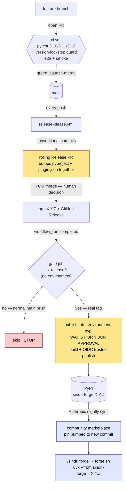

# CI/CD & release pipeline

How a change travels from a pull request to a published `sindri-forge` release and on to the
community marketplace. Three workflows compose the pipeline:

- [`.github/workflows/ci.yml`](../.github/workflows/ci.yml) — tests every PR and push.
- [`.github/workflows/release-please.yml`](../.github/workflows/release-please.yml) — stages releases.
- [`.github/workflows/publish.yml`](../.github/workflows/publish.yml) — builds + publishes to PyPI, gated.

## Diagram



<details>
<summary>ASCII fallback (same flow)</summary>

```
1 · DEVELOP
   feature branch ──open PR──▶ ci.yml (pull_request, push:main)
                                ├─ pytest 3.10 / 3.11 / 3.12
                                ├─ version-lockstep guard (pyproject == plugin.json)
                                ├─ setup-uv (SHA-pinned)
                                └─ e2e + smoke (3.12)
                                       │ green → squash-merge
                                       ▼
                                     main

2 · STAGE A RELEASE          release-please.yml (push: main)
   reads conventional commits since last release
   └─ opens/updates a rolling "Release PR"
        • bumps pyproject.toml + plugin.json TOGETHER (matched pair)
        • updates CHANGELOG + manifest
        …sits open until ──▶ YOU merge it (human decision)
                                  │
                                  ▼
              release-please tags vX.Y.Z + GitHub Release

3 · PUBLISH                  publish.yml (workflow_run ← release-please completed)
   ┌── gate job (no environment) ──┐  every main push lands here, harmlessly
   │  git describe --exact-match    │
   │  is_release? ── no ──▶ STOP     │
   └──────── yes ───────────────────┘
                 ▼
   ┌── publish job (environment: pypi) ──────────────┐
   │  ⏸ WAITS FOR REVIEWER APPROVAL (you)            │
   │  build wheel + sdist                            │
   │  OIDC trusted publishing (no token; env=pypi)   │
   │  upload ──▶ PyPI (sindri-forge X.Y.Z)           │
   └─────────────────────────────────────────────────┘
                 ▼
   PyPI live ──▶ Anthropic nightly catalog sync ──▶ community marketplace pin bumped
                 ▼
   /sindri:forge ─▶ forge.sh ─▶ uvx --from sindri-forge==X.Y.Z
```

</details>

## Stages

### 1 · Develop → CI

Open a PR; `ci.yml` runs `pytest` on Python 3.10/3.11/3.12, plus the e2e + smoke suites on 3.12. It
also runs the **version-lockstep guard** (`TestVersionLockstep`) which fails the build if
`pyproject.toml`, `.claude-plugin/plugin.json`, and the release-please manifest versions ever
diverge — that invariant is what lets the plugin safely pin `sindri-forge==<own version>`. Third-party
actions (`checkout`, `setup-python`, `setup-uv`) are pinned to commit SHAs.

### 2 · Stage a release → release-please

Every push to `main` runs `release-please.yml`. It reads the [Conventional
Commits](https://www.conventionalcommits.org/) since the last release and maintains a single rolling
**Release PR** that bumps `pyproject.toml` and `plugin.json` **together** (matched-pair versioning)
and updates the changelog. Nothing is released until **you merge that Release PR** — at which point
release-please tags `vX.Y.Z` and creates the GitHub Release. Releasing is a deliberate human action.

### 3 · Publish → PyPI (gated)

`publish.yml` triggers on `workflow_run` (release-please completing). It is split into two jobs so the
protected environment only gates real releases:

- **`gate`** — no environment, so it never prompts. It checks out the commit and runs
  `git describe --tags --exact-match HEAD`. On a normal main push there's no release tag →
  `is_release=false` → it stops. (This is why merging ordinary PRs never asks you to approve anything.)
- **`publish`** — runs only when `is_release=true`. It is bound to the protected **`pypi` environment**,
  so the deployment **waits for a required reviewer** (you) before doing anything. After approval it
  builds the wheel + sdist and uploads via **OIDC trusted publishing** — no stored PyPI token; the
  short-lived token's `environment` claim must equal `pypi` to match the PyPI trusted-publisher config.
  The publisher action is SHA-pinned.

Why the split: attaching `environment: pypi` to a single job that runs on every `workflow_run` would
prompt for approval on every push to `main`. Keeping the environment on a job that only runs for real
releases means the approval prompt fires only on a genuine `vX.Y.Z` tag.

### 4 · Marketplace (Anthropic-side)

Sindri ships through `anthropics/claude-plugins-community`, a read-only mirror whose pinned commit SHA
is **auto-bumped by Anthropic's nightly catalog sync**. A release reaches marketplace users on the next
nightly sync — it is not triggered by this repo. At runtime, `/sindri:forge` calls `scripts/forge.sh`,
which runs `uvx --from sindri-forge==<pinned version> python -m sindri` (zero-install).

## Controls at a glance

| Stage | Control | Why |
|---|---|---|
| Develop | CI green + **version-lockstep guard** | never ship a plugin pinning an unpublished version |
| Stage release | **release-please** + you merge the Release PR | matched-pair version bump; releasing is a human decision |
| Publish — gate | `is_release` exact-tag check | every main push hits publish; only real tags proceed — no approval spam |
| Publish — publish | **protected `pypi` environment → reviewer approval** | a human gates anything reaching PyPI |
| Publish — upload | **OIDC trusted publishing** (no stored token) + SHA-pinned actions | no long-lived secret to leak; supply chain pinned |
| Marketplace | Anthropic nightly sync | community users get the release the next day |

## Testing the publish gate without a release

To exercise the gated publish path without burning a version: create a throwaway `v*` tag at `main`'s
HEAD (so it carries the current workflow and matches the environment's `v*` branch policy), then
manually dispatch at it:

```bash
git tag v0.0.0-test "$(git rev-parse origin/main)" && git push origin v0.0.0-test
gh workflow run publish.yml --ref v0.0.0-test
```

Expected: the `publish` job pauses for review; approve it; the OIDC exchange succeeds (proving the
environment name matches PyPI) and the upload fails only with **"File already exists"** — which is the
pass signal. Delete the tag afterward (`git push origin :v0.0.0-test`).
